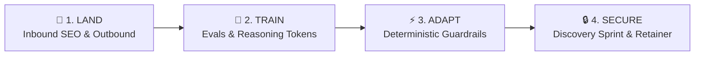

# 🚀 LinkedIn Updates & Contracting OS

[](https://github.com/rifaterdemsahin/linkedin-updates/actions/workflows/deploy.yml)
[](https://rifaterdemsahin.github.io/linkedin-updates/)
[%20Sahin-blue?style=flat&logo=linkedin)](https://www.linkedin.com/in/rifaterdemsahin/)

> **A high-impact tracking and strategic operating system documenting profile pivots, forensic CV audits, skills gap bridges, and contracting playbooks for [Erdem (Rifat) Sahin](https://www.linkedin.com/in/rifaterdemsahin/).**

---

## 🌐 Live GitHub Pages Deployments

| View | Description | Live URL |
| :--- | :--- | :--- |
| 📊 **Main Dashboard** | Live profile diffs, 1-click copy buttons, headline options, and banner review | [https://rifaterdemsahin.github.io/linkedin-updates/](https://rifaterdemsahin.github.io/linkedin-updates/) |
| 🎯 **Skills Order & Optimization** | Master 1–20 LinkedIn skills ranking, top 3 pinned hero skills, removals, and additions with 1-click copy | [https://rifaterdemsahin.github.io/linkedin-updates/skills-order.html](https://rifaterdemsahin.github.io/linkedin-updates/skills-order.html) |
| 📚 **AI & AGI Dictionary** | Technical deep dive on SHAP/LIME, adversarial attacks, and frontier architecture glossary | [https://rifaterdemsahin.github.io/linkedin-updates/dictionary.html](https://rifaterdemsahin.github.io/linkedin-updates/dictionary.html) |
| 📘 **Contracting Playbook** | Complete 4-pillar execution manual (Land, Train, Adapt, Secure) with copyable scripts | [https://rifaterdemsahin.github.io/linkedin-updates/playbook.html](https://rifaterdemsahin.github.io/linkedin-updates/playbook.html) |
| 👥 **Scored Profiles** | 5-dimension algorithmic scoring engine evaluating exported CVs & benchmark profiles | [https://rifaterdemsahin.github.io/linkedin-updates/profiles.html](https://rifaterdemsahin.github.io/linkedin-updates/profiles.html) |
| 🧠 **2026 Skills Gaps** | Forensic audit across reasoning tokens, Evals CI/CD, multi-agent swarms, and vLLM | [https://rifaterdemsahin.github.io/linkedin-updates/skills-gaps.html](https://rifaterdemsahin.github.io/linkedin-updates/skills-gaps.html) |
| ✅ **Interactive Todos** | Browser-persisted (`localStorage`) transformation task board with progress bar | [https://rifaterdemsahin.github.io/linkedin-updates/todos.html](https://rifaterdemsahin.github.io/linkedin-updates/todos.html) |

---

## 📌 Strategic Profile Evolution

```
┌──────────────────────────────────────────────┐
│  PREVIOUS POSITIONING                        │
│  "Claude Certified Architect Professional"   │
│  • Vendor tool admin perception              │
│  • Codespaces in top 3 skills (wasted slot)  │
│  • "Greater Cambridge Area"                  │
└──────────────────────┬───────────────────────┘
                       │ 🚀 PIVOT
                       ▼
┌──────────────────────────────────────────────┐
│  TARGET 2026 HIGH-TICKET POSITIONING         │
│  "AGI Researcher & Agentic Systems Architect"│
│  • Frontier reasoning & cognitive loops      │
│  • Top skills: AGI, Autonomous Agents, Evals │
│  • Cambridge, England, United Kingdom        │
│  • £1,000–£1,800/day Outside-IR35 advisory   │
└──────────────────────────────────────────────┘
```

---

## 💎 Confirmed Live Updates

- ✅ **Core Headline (Update #003)**: `AGI Researcher & Agentic Systems Architect` (Applied Live on LinkedIn).
- ✅ **Full Name (Update #002)**: `Erdem (Rifat) Sahin` (Bridges legal contracting entity with public personal brand).
- ✅ **Location (Update #002)**: `Cambridge, England, United Kingdom` (Captures Cambridge Silicon Fen / University recruiter boolean filters).
- ✅ **Custom Header Banner**: `assets/linkedin_banner_28_September_2026.jpeg` featuring the transformation formula:  
  `[Legacy World] + [Be Skilled and Certified] × [Build AGI] → [The Future You Will Lead]`  
  *Tagline: "BUILD YOUR AGI WITH DeliveryPilot"*

---

## 🎯 The 4 Pillars to Land, Train, Adapt & Secure Contracts



1. 🎯 **LAND**: Set "Open to Work" to Recruiters Only (`AGI Researcher`, `Fractional Head of AI`). Pitch 3-point agent loop failure mode audits directly to Series A-C CTOs.
2. 🔬 **TRAIN**: Master **Evaluation Engineering (Evals)** (DeepEval, Ragas, TruLens) — the #1 capability missing in Fortune 500 enterprise AI.
3. ⚡ **ADAPT**: Implement the **Smallest Viable Agent** rule; wrap stochastic models in strict Pydantic schemas and Langfuse tracing to guarantee ROI.
4. 🔒 **SECURE**: Lead with a **2-Week Architecture Discovery Sprint** (£5,000–£10,000 fixed fee) that naturally converts into an ongoing fractional retainer (£1,000–£1,500/day).

---

## 👥 Candidate & Export Scoring Engine

Profiles and CV variants are scored out of 100 across 5 weighted contracting criteria:

| Profile Asset | Overall Score | Grade | Key Moat |
| :--- | :---: | :---: | :--- |
| 🌟 **Erdem (Rifat) Sahin (Live Target)** | **92 / 100** | **Grade A+** | Goldman Sachs + Microsoft + Adversarial ML + AGI Title |
| 🛡️ **Erdem Sahin (AI Security CV)** | **87 / 100** | **Grade A-** | 98/100 on Evals & Guardrails (SHAP, LIME, FGSM defenses) |
| 🏛️ **Erdem Sahin (Solutions Architect CV)** | **84 / 100** | **Grade B+** | Enterprise architecture credibility & cloud infrastructure |
| 📣 **Naresh Harwani (Benchmark)** | **76 / 100** | **Grade B** | World-class social proof & audience authority |
| ⏳ **Erdem Sahin (Legacy Baseline)** | **68 / 100** | **Grade C+** | Certified Claude mastery, but limited by vendor framing |

---

## 📂 Repository File Structure

```
├── .github/workflows/
│   └── deploy.yml             # 🤖 Automated GitHub Pages deployment pipeline
├── assets/
│   └── linkedin_banner_*.jpeg # 🖼️ Custom LinkedIn profile banner
├── exports/                   # 📄 Archived CV and LinkedIn profile export PDFs
│   ├── linkedin_profle_28_september_2026.pdf
│   ├── cv_ai_security_engineer.pdf
│   ├── cv_ai_solutions_architect.pdf
│   └── naresh-harwani-influencer-profile.pdf
├── index.html                 # 📊 Main Dashboard & Update Manager
├── skills-order.html          # 🎯 LinkedIn Skills Order, Removals & Additions Engine
├── dictionary.html            # 📚 AI & AGI Dictionary (SHAP/LIME, XAI, Glossary)
├── playbook.html              # 📘 Strategic Contracting Playbook (Interactive HTML)
├── profiles.html              # 👥 Scored Profiles & Benchmark Engine
├── skills-gaps.html           # 🧠 2026 AI Skills Gap Matrix & Bridge Strategy
├── todos.html                 # ✅ Interactive Task Management Board
├── nav.js                     # 🌐 Shared Navigation & Global Search (Ctrl+K)
├── nav.css                    # 🎨 Shared Navigation & Modal Styling
├── CONTRACTING_PLAYBOOK.md    # 📘 Markdown Playbook Source
├── CV_ANALYSIS.md             # 🔍 Forensic 29-page CV Audit Document
├── UPDATES.md                 # 📝 Profile Revision Changelog
└── README.md                  # 📖 Project Overview & Live Links
```

---

## 💻 Local Preview & Development

Run the local web server on port **30083** (or any 30k+ port):

```bash
# Start the local server
python3 -m http.server 30083

# Open directly in Google Chrome
open -a "Google Chrome" http://localhost:30083/skills-order.html
```

---

## 🔗 Quick Links

- 🌐 **Live GitHub Pages App**: [https://rifaterdemsahin.github.io/linkedin-updates/](https://rifaterdemsahin.github.io/linkedin-updates/)
- 🎯 **Skills Order & Ranking**: [https://rifaterdemsahin.github.io/linkedin-updates/skills-order.html](https://rifaterdemsahin.github.io/linkedin-updates/skills-order.html)
- 📚 **AI & AGI Dictionary**: [https://rifaterdemsahin.github.io/linkedin-updates/dictionary.html](https://rifaterdemsahin.github.io/linkedin-updates/dictionary.html)
- 📘 **Contracting Playbook**: [https://rifaterdemsahin.github.io/linkedin-updates/playbook.html](https://rifaterdemsahin.github.io/linkedin-updates/playbook.html)
- 👥 **Exported Profiles**: [https://rifaterdemsahin.github.io/linkedin-updates/profiles.html](https://rifaterdemsahin.github.io/linkedin-updates/profiles.html)
- 🧠 **Skills Gaps**: [https://rifaterdemsahin.github.io/linkedin-updates/skills-gaps.html](https://rifaterdemsahin.github.io/linkedin-updates/skills-gaps.html)
- ✅ **Todos Board**: [https://rifaterdemsahin.github.io/linkedin-updates/todos.html](https://rifaterdemsahin.github.io/linkedin-updates/todos.html)
- 🔗 **LinkedIn Profile**: [https://www.linkedin.com/in/rifaterdemsahin/](https://www.linkedin.com/in/rifaterdemsahin/)
- 🐙 **GitHub Repository**: [https://github.com/rifaterdemsahin/linkedin-updates](https://github.com/rifaterdemsahin/linkedin-updates)
